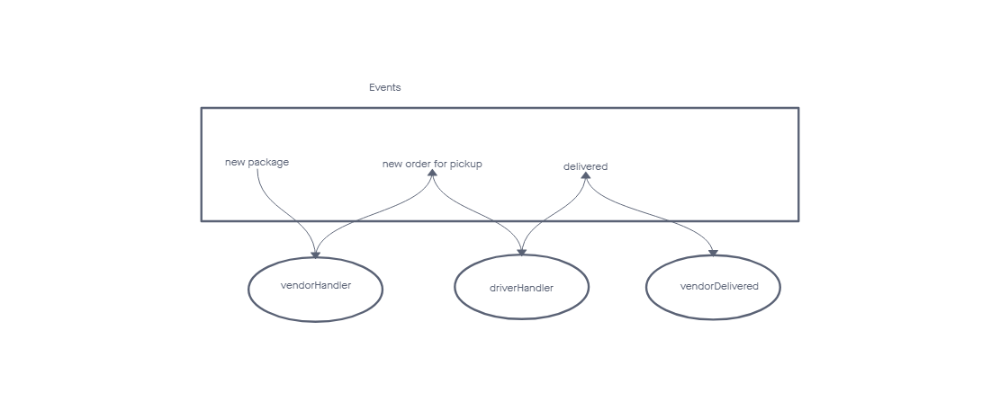

# CAPS

## Project: Caps

## Author: Seth P. Pierce

github actions <https://github.com/sethppierce/CAPS/actions>

### Problem Domain

### Phase 1

- As a vendor, I want to alert the system when I have a package to be picked up.
- As a driver, I want to be notified when there is a package to be delivered.
- As a driver, I want to alert the system when I have picked up a package and it is in transit.
- As a driver, I want to alert the system when a package has been delivered.
- As a vendor, I want to be notified when my package has been delivered.

And as developers, here are some of the development stories that are relevant to the above.

- As a developer, I want to use industry standards for managing the state of each package.
- As a developer, I want to create an event driven system so that I can write code that happens in response to events, in real time.

### Phase 1 features

- hub - sends a new package out to be picked up
- vendorhandler - lets driver know that there is a new package
- driverhandler - picks up and begins delivery
- driverdelivered - finishs delivery and notifies vendor
- vendordelived - thanks driver for delivering package

### Phase 2

- As a vendor, I want to alert the system when I have a package to be picked up.
- As a driver, I want to be notified when there is a package to be delivered.
- As a driver, I want to alert the system when I have picked up a package and it is in transit.
- As a driver, I want to alert the system when a package has been delivered.
- As a vendor, I want to be notified when my package has been delivered.

And as developers, here is our updated story relevant to the above.

- As a developer, I want to create network event driven system using Socket.io so that I can write code that responds to events originating from both servers and client application

### Phase 2 features

- server - listens for connections and lets client know they're connected, and emits different messages based on the message recieved.
- vendor - sends an ORDERIN message for the driver to pickup, also recieves DELIVERED Message and thanks driver
- driver - gets alerted on new order, notifies the server that order is in transit, and then alerts the server when it gets delivered

